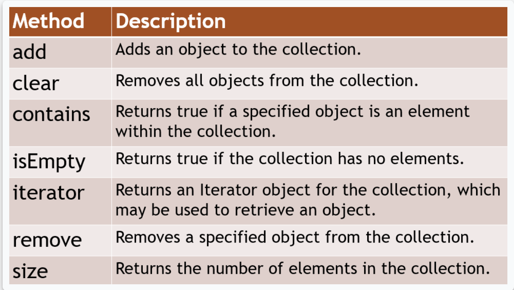
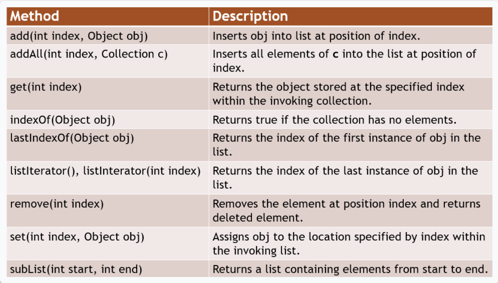
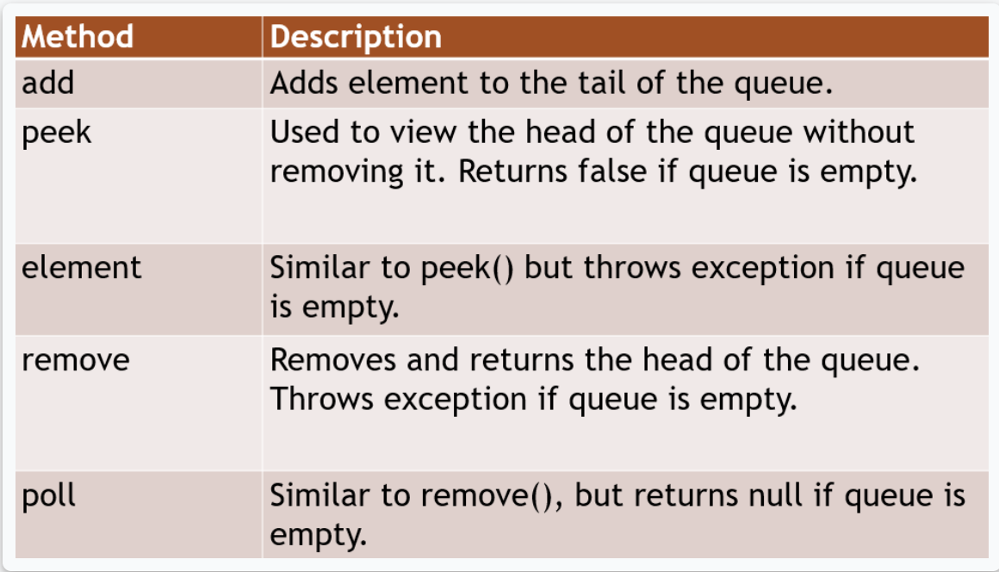
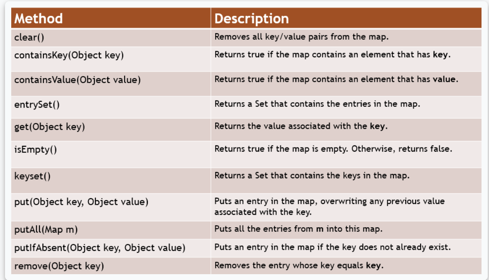

# Inheritance

* Java is an object-oriented programming language.
* Inheritance is where one class becomes an extension of another class, therefore inheriting the members of that class.
* There are two parties involved in an inheritance — a parent and a child.
* The **parent** is known as the superclass, or sometimes also referred to as the parent class or base class.
* The **child** is known as the subclass, or sometimes referred to as the child class or the derived class.
* When an inheritance relationship is created between these two classes, then the child class inherits the members of the parent class.
* This allows classes to reuse data that already exists within other classes.
* Subclasses should be a more specialized form of the superclass that they inherit from.
* Person class and employee classs

## Constructors in Inheritance

* Rules
  * Superclass constructors run first
  * Use super to call specific constructors
  * super calls must be first
  * some constructors must be executed
* [Explanation](https://testautomationu.applitools.com/java-programming-course/chapter9b.html)

## Overriding inherited methods

* a subclass inherits the members of its parent, however, a subclass may want to change the functionality of a method that it inherited. - overriding
* Rectangle and Square
* It's encouraged that you use the override annotation, which is the @ symbol followed by the word Override — @Override. This is not required, but it's strongly encouraged. This lets Java know that your intention is to override the method that you inherited from your super class.

## Polymorphism

* Polymorphism is the ability to take multiple forms. Specifically, in object-oriented programming, polymorphism is where a subclass can define their own unique behaviors, and yet share some of the same behaviors of their superclass.
* An example of polymorphism is where an object has a superclass type but is an instance of a subclass.
* [Link](https://testautomationu.applitools.com/java-programming-course/chapter10.html)

## Abstraction

* Abstraction is defined as something that exists in theory but does not have a concrete existence. In Java, we have the reserved word, abstract — which is a non-access modifier that can be used on classes and methods. It is used when you want to define a template for a class or a method, but do not intend for it to be used as is.
* An abstract class is not designed to be instantiated. It's designed to be extended, thus pushing the burden of implementation onto the subclass.
* An abstract method has no body, only the signature of the method is defined, and it is not designed to be run as is. It's designed to be overridden by a subclass.
* [Link](https://testautomationu.applitools.com/java-programming-course/chapter11a.html)

## Interfaces

* An interface is similar to an abstract class, except that in an abstract class there can be some methods that are implemented.
* However, an interface consists of all abstract methods. Because all of the methods of an interface are abstract by nature, there's no need to declare the methods as abstract. It's just a given.
* Interfaces are **implemented**, not extended as classes
* Any class that implements an interface must implement all of its methods, or it must declare itself as an abstract class.
* Java 8 introduced a new option, where I can declare methods as default within interfaces.
* If you declare the method as default you can provide a default implementation for this method.
* Interfaces cannot be instantiated and they're all public.
* While a class can only extend one class, it can implement multiple interfaces.
  * To implement multiple interfaces, the class header must specify a comma delimited list of names of all of the interfaces that it would like to implement
  * If a class declares that it will implement multiple interfaces, then it must provide the methods specified by all of those interfaces.
  
## Collections

* A Collection is an object that holds references to other objects. These are data structures and the objects within the collection are known as elements.
* Most common collections
  * **Set** - unordered unique elements
    * Methods for sets
    
  * **List** - ordered elements which can be accessed by position, can contain duplicates
    * Methods for sets
     
  * **Queue** - Ordered elements for processing. Access in the order elements were added FIFO
    * First element - **head**, last element **tail**
    * Methods for queues
      
  * **Map**  - unordered unique key-value pairs, it does not inherit from the Collection interface
    * Methods for maps
      

## Exceptions

* An exception is an unexpected event that occurs at runtime due to an error. Exceptions disrupt the normal flow of a program.
* You can handle exceptions within your code so that the program doesn't crash and so that you can provide a meaningful message in case of an error.
* All exceptions inherit from the Exception class.
* There can be multiple catch clauses to handle different types of exceptions.
* If the multiple catch clauses contain related exceptions, the subclass’ catch clause must appear first. 
* Multiple exceptions - The way we do that is by using the pipe symbol: |.
* A finally clause can optionally be added below any catch clauses.
* This clause is executed after try and after any catch clauses, even if the catch clauses don't execute.
  * The finally block says, "Hey, even if you finish everything in the try, even if no exceptions are thrown, I will execute whatever you place inside of me." So, this will execute no matter what — if exceptions are thrown, or if exceptions are not thrown — finally will execute.

## Escaping sequence

* Escape sequence is special character sequence that represents another character. Escape sequences are
used to represent characters that cannot be used directly in a string
* to escape backspace -  `\b`
* to escape newline - `\n`
* to escape tab - `\t`
* to escape carriage return - `\r`
* to escape backslash `\\`
* to escape double quote `\"`
* to escape single quote `\'` 

## Math methods

* **Math.abs(a)** - absolute value of input
* **Math.round(a)** - return the integer nearest to the input 
* **Math.ceil(a)** - returns the smallest integer bigger than or equal to input value 
* **Math.floor(a)** - returns the biggest integer tact is smaller than or equal to the input value 
* **Math.exp(a)** - return the exponential of the input value 
* **Math.max(a,b)** - returns the bigger between the two input values
* **Math.min(a,b)** - returns the smaller between the two input values.
* **Math.pow(a,b)** - returns the value of the first value raised to the power of the
  second value.
* **Math.sqrt(a)** - returns the square root of the input value.
 

