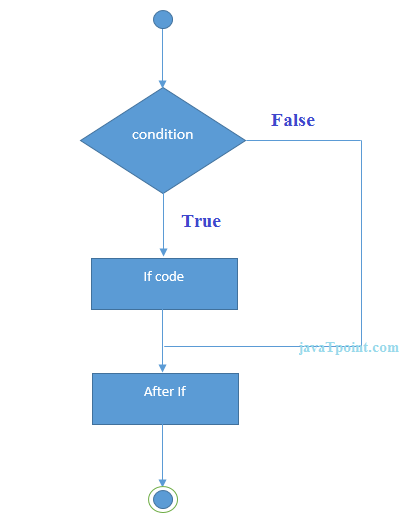
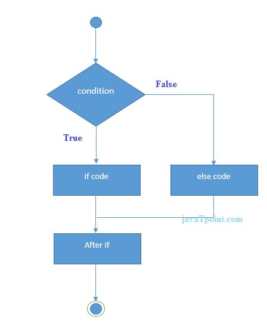
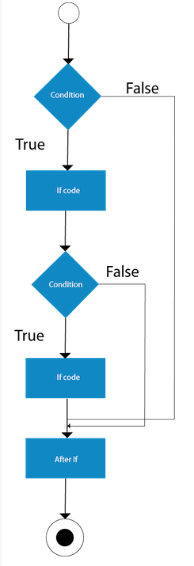
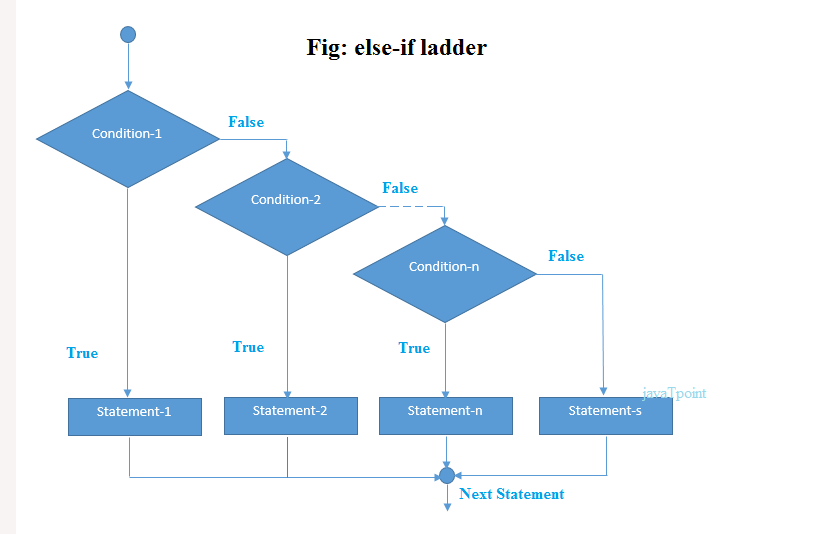
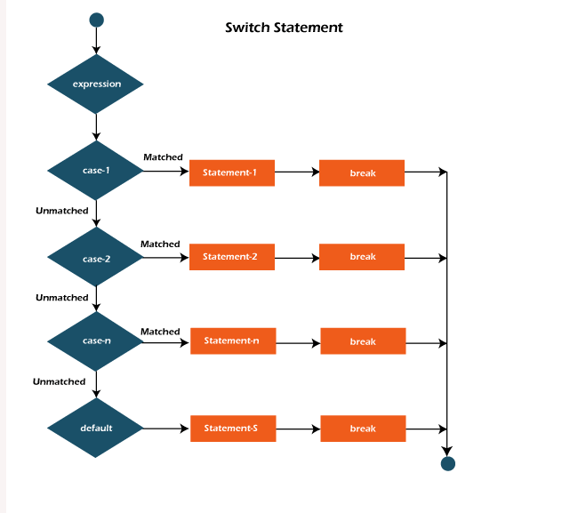

# Control flow and decision-making

* Decision-making in programming is similar to decision-making in real life.
* In programming also face some situations where we want a certain block of code to be executed when some condition is fulfilled.
* Java compiler executes the code from top to bottom.
* However, Java provides statements that can be used to control the flow of Java code. Such statements are called control flow statements. It is one of the fundamental features of Java, which provides a smooth flow of progra
* Three types of control flow statements
  * Decision-making
    * if
    * switch
  * Loop
    * do while
    * while
    * for
    * for each
  * Jump
    * break
    * continue

## Selection Statements

1. **if** - It is used to decide whether a certain statement or block of statements will be executed or not
   1. if a certain condition is true then a block of statement is executed otherwise not
   2. Description - If a certain situation occurs, _do something_ and then go back to the main flow.
   3. 
   4. syntax
```java
    if(condition){
        // Statements to execute if
        // condition is true
    }
```
2. **if-else** - We can use the else statement with if statement to execute a block of code when the condition is false.
   1. If certain situation occurs do something. Otherwise, do something else
   2. 2 paths
   3. If we have only one condition then {} can be ommited
   4. 
   5. syntax
```java
   if(condition){
    //execute if true
    } else {
        // execute if false
    }
```
3. **nested-if** -  Nested if statements mean an if statement inside an if statement
   1. Description - The if-else-if statement is used when there are more than two possible paths.
      1. If situation A occurs, do something
      2. Else if situation B occurs do something else
      3. Else if situation C occurs do somthing else
   2. 
   3. syntax
```java
    if(condition1){
    //execute when condition 1 is true
        if(condition2){
            //execute if condition2 is true
        }
    }   
```
4. **if-else-if** - The if statements are executed from the top down. 
   1. As soon as one of the conditions controlling the if is true, the statement associated with that if is executed, and the rest of the ladder is bypassed. 
   2. If none of the conditions is true, then the final else statement will be executed
   3. 
   4. syntax
```java
    if (condition)
        statement;
    else if (condition)
        statement;
    else
        statement;
```
5. **switch** - The switch statement is a multiway branch statement. 
   1. It provides an easy way to dispatch execution to different parts of code based on the value of the expression.
      1. If situation A occurs, do something. 
      2. Else if situation B occurs, do something else. 
      3. Else if situation C occurs, do something else.
   2. The first one that is true is executed, same as in if-else-if
   3. The case values must be unique. In case of duplicate value, it renders compile-time error.
   4. the if-else-if checks the condition to be true; whereas the switch statement checks for equality
   5. **expression** can be byte, short, int char, or an enumeration(and String)
   6. duplicate case values are not allowed
   7. **default** statement is optional
   8. **break** terminates statement sequence
      1. break is optional. If omitted, execution will continue on into the next case
   9. 
   10. syntax
```java
    switch (expression)
        {
    case value1:
        statement1;
        break;
    case value2:
        statement2;
        break;
        .
        .
    case valueN:
        statementN;
        break;
    default:
        statementDefault;
        }
```
6. **jump** Java supports three jump statements: **break, continue and return**. These three statements transfer control to another part of the program.
   1. **break**
      1. Terminate a sequence in a switch statement
      2. To exit a loop
   2. **continue**
      1. you might want to continue running the loop but stop processing the remainder of the code in its body for this particular iteration
   3. **return**
      1. The return statement is used to explicitly return from a method. That is, it causes program control to transfer back to the caller of the method.