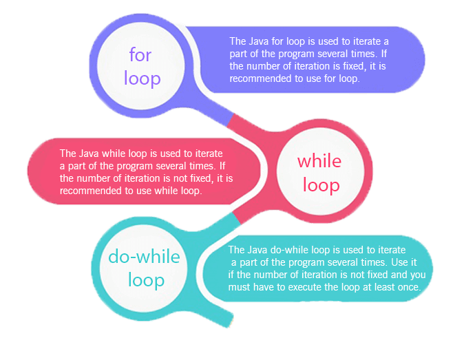

# Loops

Looping in programming languages is a feature which facilitates the execution of a set of instructions/functions repeatedly while some condition evaluates to true

Loops are structures that cause a block of code to repeat.

Programmers use the mnemonic DRY, which stands for Don't Repeat Yourself.



## While loop

* Allows code to be executed repeatedly based on a given Boolean condition.
* Entry Control loop
* The while loop can be thought of as a repeating if statement.
* Loop continues running while the specified condition remains true
* Condition is tester before entering the loop
* Flow
  * While loop starts with the checking of condition.
  * If it evaluated to true, then the loop body statements are executed otherwise first statement following the loop is executed.
  * Once the condition is evaluated to true, the statements in the loop body are executed. Normally the statements contain an update value for the variable being processed for the next iteration.
  * When the condition becomes false, the loop terminates which marks the end of its life cycle.
* Notes
  * While has condition before the block - block is never executed if condition is false from start
  * So, to conclude, there is chance that while block will never be executed

Syntax:

```java
    while (boolean condition)
    {
      // loop statements...
    }
```

## For loop

* provides a concise way of writing the loop structure
* Entry Control loop
* count-controlled
* for statement consumes the **initialization, condition and increment/decrement in one line**
* Flow
  * **Initialization condition:** Here, we initialize the variable in use. Start of for loop
  * **Testing Condition:** It is used for testing the exit condition for a loop. It must return a boolean value.
  * **Statement execution:** Once the condition is evaluated to true, the statements in the loop body are executed.
  * **Increment/ Decrement:** It is used for updating the variable for next iteration. 
  * **Loop termination:** When the condition becomes false, the loop terminates marking the end of its life cycle.
* Notes
  * Counter i is defined only in block of for loop.
  * If we want to use it elsewhere we need to define it outside the foor loop

Syntax:

```java
    for (initialization condition; testing condition; increment/decrement){
        // statement(s)
    }
```

## Do while Loop

* is similar to while loop with only difference that it checks for condition after executing the statements, and therefore is an example of **Exit Control Loop**.
* used when you want to allow a user to run as many calculations as they like without having to restart the program each time
* Condition controlled, post test - condition is tested after completing the loop
* it's good to use the do while loop when the loop should run at least one time, and based on the situation, they now need to repeat.
* Flow
  * do while loop starts with the execution of the statement(s).
  * There is no checking of any condition for the first time
  * After the execution of the statements, and update of the variable value, the condition is checked for true or false value. If it is evaluated to true, next iteration of loop starts.
  * When the condition becomes false, the loop terminates which marks the end of its life cycle
  * It is important to note that the do-while loop will execute its statements atleast once before any condition is checked, and therefore is an example of exit control loop.
* Notes
  * If we want our code to run at least once, we use do while loop.
  * This loop first executes statement  and at the end it checks condition

Syntax:

```java
    do{
        statements..
    } while (condition);
```

## Nested loops

Sometimes your repetitive tasks also contain repetitive sub-tasks. In the case, you need a loop inside of a loop.

These are also known as nested loops.


