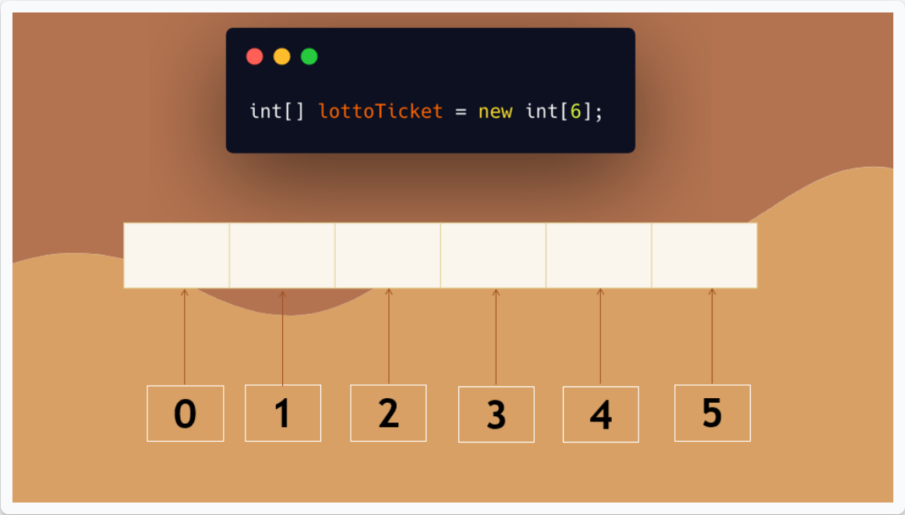

# Arrays

* Arrays are special objects or containers which can hold multiple values.
* Declaration of array `int[] lottoTicket = new int[6];`
  * **int** - data type, all values must be of the same data type
  * **[]** - indicate an array of ints, can appear after data type or after variable name
  * **lottoTicket**  - name
  * **=** - after name, equal sign
  * **new** - keyword
  * **[6]** - This number inside of the brackets represents the length of the array, meaning how many values can this array store. Once the length is declared, it's fixed — meaning it cannot be lengthened to hold more values.
  * 
  * Notice that the indices begin with 0; and index 0 represents the first element of the array.
* Adding values to array
```java
lottoTicket[0] = 24;
lottoTicket[1] = 10;
lottoTicket[2] = 5;
lottoTicket[3] = 1;
lottoTicket[4] = 800;
lottoTicket[5] = 11;
```
  * Each element in an array works as an individual variable. 
  * It can be **read** or set by accessing its **index**. 
  * We can **assign** values to an element of the array by specifying the elements index.
  * Alternatively, if you know all values of the array's elements, you can use curly braces as a shortcut to initialize the array.
  * `int[] lottoTickets = {24,10,5,1,800,11}`
  * To **read** the value of an element, you simply use the array's name and the index of the element that you like.
    * `lottoTicket[2] //returns 5`\

## Searching arrays

## Tricks for arrays
