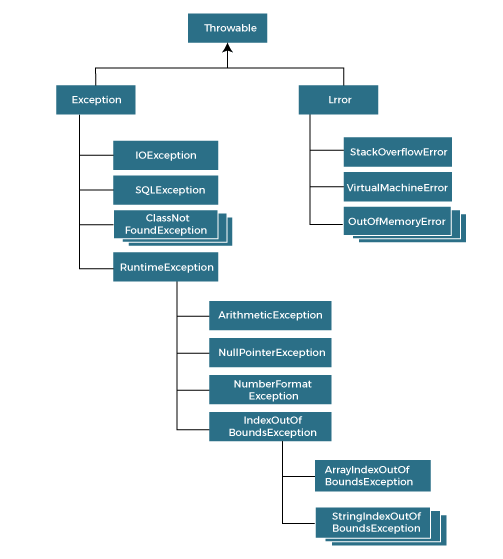

## What is Exception?

* Exception is an abnormal condition. 
* an event that disrupts the normal flow of the program. It is an object which is thrown at runtime.

## What is Exception Handling?

* Exception Handling is a mechanism to handle runtime errors such as ClassNotFoundException, IOException, SQLException, RemoteException, etc.
* Core advantage - to maintain the normal flow of the application
* Hierarchy of Java Exception Classes:
  * 
* Types of exceptions in Java according to Oracle
  * **Checked**
    * Class that inherit Throwable class except RuntimeException and Error
    * IOException, SQLException...
    * checked at compile time
  * **Unchecked**
    * The class that inherit the RuntimeException
    * ArithmeticException, NullPointerException, ArrayIndexOutOfBoundsException...
    * checked at runtime
  * **Error**
    * irrecoverable
    * OutOfMemoryError, VirtualMachineError, AssertionError
  
## Java Exception Keywords

* `try` - to specify block where we should place an exception code
  * must be followed by catch or finally
* `catch` - to handle the exception
  * can be followed with finally
* `finally` - executes the necessary code of the program
  * whether the exception is thrown or not it is executed
* `throw` - throws an exception
* `throws` - declares exceptions, specifies that exception may occur
  * used with method signature

