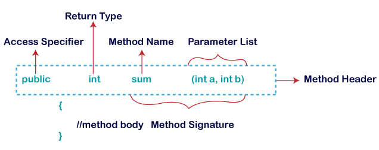

# Methods

* In Java, methods are subtasks within a class. 
* Methods are used to break a complex problem into small, manageable pieces.
* Method provides re-usability of code
* Methods should perform a specific task and can help eliminate redundancy in code.
* We write method once and use it many times - DRY principle and readability achieved
* Most important method in Java is **main()**

## Method declaration

* Method declaration provides information about method attributes: visibility, return-type, name and arguments
* 
* **Method signature** - part of method declaration - method name and parameter list
* **Access specifier** - specifies method visibility
  * `public` - all classes can reach it
  * `private` - accessible only in class it was declared in
  * `protected` - accessible within the package or within subclasses in different packages
  * `default` - when no access is specified - same package access
* **Return type** - data type that method returns
  * primitive data type or object, collection etc.
  * **void** if method doesn't return anything
* **Method name** - a unique name corresponding to the functionality. Method is invoked by its name.
* **Parameter list** - list of parameters separated by comma inside `()`. contains data type and data name
* **Method body** - actions to be performed inside `{}`

## Naming convention

* Name must be a **verb** that starts with **lowercase** letter. If multiple words are name of method every first letter is **capital**
* It is possible to have more methods with same name - **method overloading** but in that case list of parameters is different

## Types of methods

* **Predefined methods** already existing in Java
  * examples: `length()`, `equals()`, `print()`
* **User defined methods** - written by user

## Static methods

* Method that has **static** keyword is static method. Method that belongs to class rather than instance of class is static method.
* We can call them without creating an object
* It is used to create an instance method. It is invoked by using the class name. The best example of a static method is the main() method.

## Instance methods

* The method of the class is known as an instance method.
* It is a non-static method defined in the class. Before calling or invoking the instance method, it is necessary to create an object of its class.
* Instance methods can be **accessor** methods
  * used to get information - also known as **getters**
  * returns value of private field
  * usually prefixed with **get word**
* can also be **mutator** methods
  * used to modify information - **setters**
  * doesn't return anything
  * usually prefixed with **set word**

## Abstracts methods

* The method that does not has method body
* It always declares in the abstract class. It means the class itself must be abstract if it has abstract method. 
* To create an abstract method, we use the keyword **abstract**.

## Parts of methods

```java
    public static int calculateSum(int num1, int num2){ // header
     // body
        int sum = num1 + num2;
        return sum;
        }
```

Header items: 
* **public** - access modifier
  * indicate who is allowed access to use this method.
* **static** - non-access modifier
  * every method requires on of them(static, final, abstract, synchronized)
* **int** - return type
  * data type of the value that this method will return to the code that calls it
  * Every method is required to specify a return type.
  * _void_ -  Meaning, it is not going to return any value. So, even if your method returns nothing, you still have to specify a return type.
  * It's also important to note that a method can only return one value.
* **calculateSum** - name. Required
  * should begin with verb
  * if is boolean then method asks a question, for example - _isSumNegative_
  * lower case by convention
* **()** - set of parentheses
  * required, can be empty
  * parameter list container
  * comma-delimited list of inputs
* **signature** - name of the method and method's parameter list
  * must be unique within a class

## Notes

* After the method's header, comes the method's body, which is contained within a set of curly braces: {}
* The body consists of 0 or more statements that are to be executed should this method be called.
* If the body has specified a return type as anything other than void, the method must include a return statement, that returns a value that matches the return type specified in the header.

