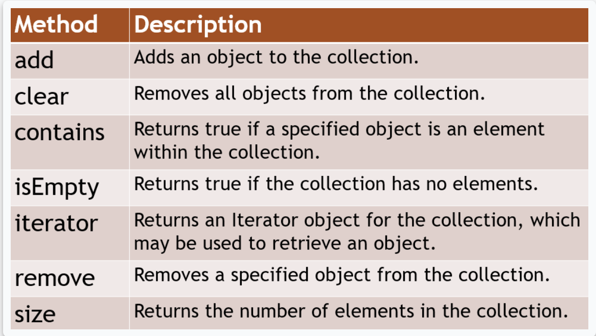
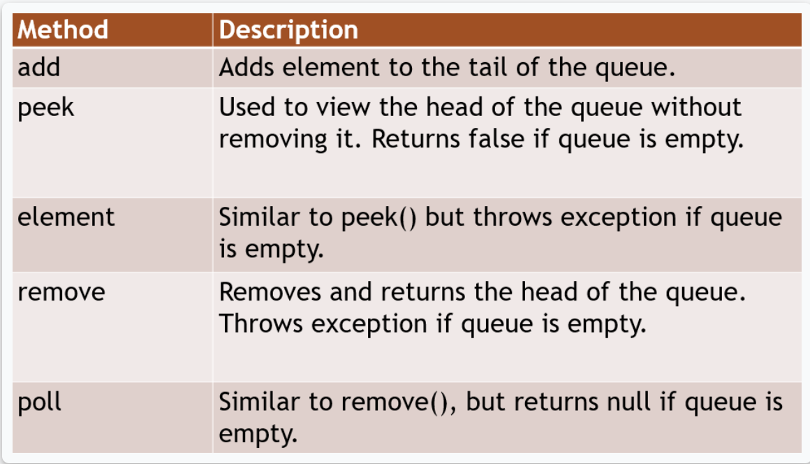
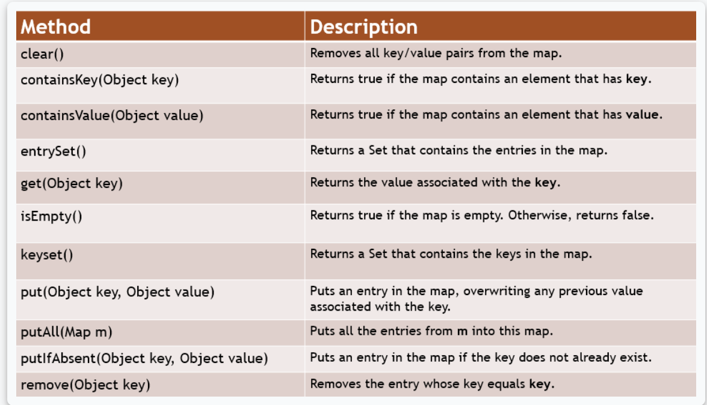

## Escaping sequence

* Escape sequence is special character sequence that represents another character. Escape sequences are
used to represent characters that cannot be used directly in a string
* to escape backspace -  `\b`
* to escape newline - `\n`
* to escape tab - `\t`
* to escape carriage return - `\r`
* to escape backslash `\\`
* to escape double quote `\"`
* to escape single quote `\'` 

## Math methods

* **Math.abs(a)** - absolute value of input
* **Math.round(a)** - return the integer nearest to the input 
* **Math.ceil(a)** - returns the smallest integer bigger than or equal to input value 
* **Math.floor(a)** - returns the biggest integer tact is smaller than or equal to the input value 
* **Math.exp(a)** - return the exponential of the input value 
* **Math.max(a,b)** - returns the bigger between the two input values
* **Math.min(a,b)** - returns the smaller between the two input values.
* **Math.pow(a,b)** - returns the value of the first value raised to the power of the
  second value.
* **Math.sqrt(a)** - returns the square root of the input value.

## Collections

* A Collection is an object that holds references to other objects. These are data structures and the objects within the collection are known as elements.
* Most common collections
  * **Set** - unordered unique elements
    * Methods for sets
      
  * **List** - ordered elements which can be accessed by position, can contain duplicates
    * Methods for sets
      
  * **Queue** - Ordered elements for processing. Access in the order elements were added FIFO
    * First element - **head**, last element **tail**
    * Methods for queues
      
  * **Map**  - unordered unique key-value pairs, it does not inherit from the Collection interface
    * Methods for maps
      

## Stream Filter and Streams - Java 8

<https://www.javatpoint.com/java-8-stream-filter>
<https://www.javatpoint.com/java-8-stream>

## Enums

<https://www.javatpoint.com/enum-in-java>