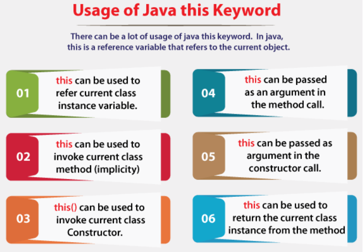

# Static keyword

* The static keyword in Java is used for memory management mainly.
* The static keyword belongs to the class than an instance of the class.
* What can be static:
  * **variable** - class variable
    * static variable is common property (companyName for employees, collegeName for students)
    * only invoked once after object is created (for 500employees only once we declare companyName if it is static, otherwise 500times)
    * Java static property is shared to all objects.
  * **method** - class method
    * A static method belongs to the class rather than the object of a class
    * A static method can be invoked without the need for creating an instance of a class.
    * A static method can access static data member and can change the value of it
    * Restrictions:
      * The static method can not use non-static data member or call non-static method directly. 
      * this and super cannot be used in static context.

# This keyword

* Reference variable that refers to the current object
* 
