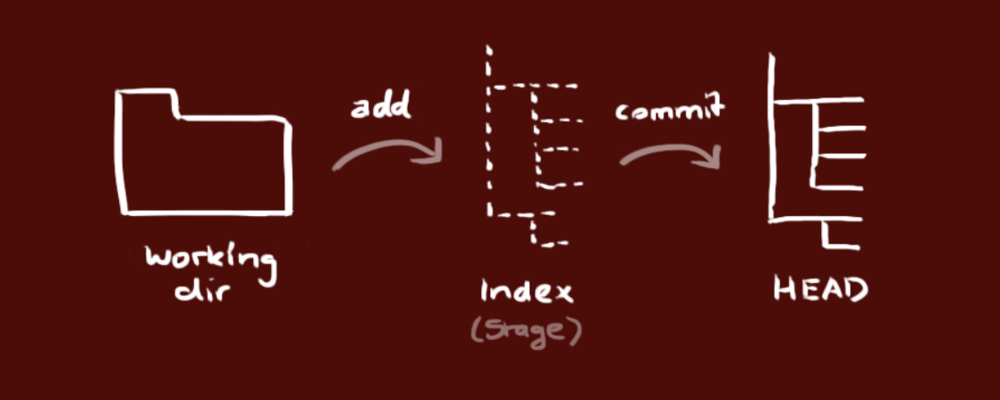
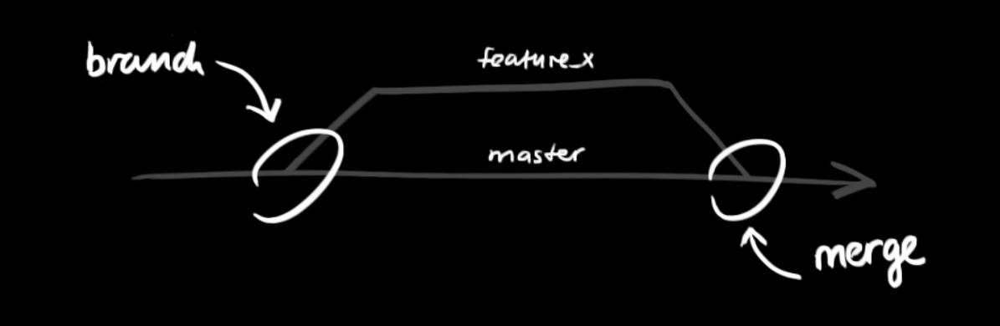

# Git

## Download git

* [Link for download](https://gitforwindows.org/)

## Commands - basic

* `git init` - initializes .git repository
* Configure git globally
  * `git config --global user.name "Your Name"`
  * `git config --global user.email "youremail@yourdomain.com"`
* `git clone` - to clone existing repository from remote source
  * to create copy of local repository use `git clone /path/to/repo`
  * to create copy of remote repository use `git clone username@host:/path/to/repo`
* Workflow
  * Local repository consists of 3 "trees" maintained by git
    * **Working directory** - actual files
    * **Index** - staging area
    * **HEAD** - points to last commit we made

* `git add <filename>` - add changes to **Index** - propose changes
  * `git add *` - add all tracked
  * `git add .` - add all changes tracked 
* `git commit -m "Commit message"` - to commit changes. After this step changes are committed to the **HEAD**, but still not on remote repository
* `git push origin master` - to send changes on local HEAD to remote repository. Master can be any other needed branch too. 
  * `git remote add origin <server>` - if wee need to first connect to remote repository we need to add it first with this command before pushing
* `git pull` - to update local repository to the newest commit on remote repository
  * this command fetches and merges remote changes

## Branching

* Branches are used to develop features isolated from each other, The **master** branch is the default branch when we create repository. 
  * Now the default branch is no longer **master** but **main** instead of it. This is to skip master-slave references
* We use other branches for development and merge them back to the master branch upon completion

* to create new branch we use `git checkout -b feature_x`
* to switch back to master we use `git checkout master`
* to delete branch `git branch -d feature_x`
* Branch is not available for others before we push it to the remote repository using `git push origin <branch>`
* To merge another branch **into active branch** we use `git merge <branch>`
  * In both, **git pull** and **git merge** command git tries to auto-merge changes
  * Sometimes it is not possible to auto merge and **conflicts** appear. We are responsible to merge those conflicts manually by editing the files shown by git.
  * After changing files we need to mark them as merged with `git add <filename>`
* To preview changes before merging we can use `git diff <source_branch> <target_branch>` 

## Tagging

* For releases, we should create tags - for example for version 1.0 we could use `git tah 1.0 1b2e1d63ff`
  * 1b2e1d63ff stands for the first 10 characters of teh commit id we want to reference with tag
  * to get commit id we execute `git log`

## Logs

* Used to study repository history
* Takes a lot of parameters for us to see in logs what we actually want
* Some examples
  * `git log --author=nina`
  * `git log --pretty=oneline`
  * `git log --graph --oneline --decorate --all`
* To see all parameters with explanations use `git log --help`

## Replace local changes

* In case we did something wrong we can replace local changes using `git checkout --<filename>`
  * this replaces the changes in our working tree with the last content in HEAD
* To drop all local changes and commits that are still not on server we can fetch the latest history from the server and point local master branch with this command
  * `git fetch origin`
  * `git reset --hard origin/master`

## .gitignore file

* USed in projects to ignore files in git
* `*` - used as a wildcard
  * `*.exe` - all files with .exe extension
* `name/` - ignores directories with the name
  * `vendor/` - ignore vendor directory
* `#` - comment
* `[...]` - ignores values with any of the values
  * `*.[abc]` - ignores files - file.a, file.b, file.c
* What to put in .gitignore
  * System specific files
  * IDE files
  * Security/API keys / secrets
* To see all ignored files use `git status -ignored`

## Tips and Tricks and Important notes

* Always use commands in this order **COMMIT PULL PUSH**
* You can check status of repository and see what is new by typing `git status`
* **Stashing** changes - If we need to switch to new branch or on existing one because of emergency, and we do not want to commit unfinished changes we can stash them using
  * `git stash` - hides changes that are local and let us checkout to other branch
  * to revisit previous changes we run `git stash pop`
  * if we do not need changes we can drop them `git stash drop`
* Perform `git pull` frequently to avoid major conflicts and make merging easier
* Use autocomplete options in terminal with `TAB` and use built-in Git commands inside IntelliJ
* To delete local branch that no longer exist in remote server perform these
  * on each fetch/pull `git config --global fetch.prune true`
* Git blame is powerful tool that can be used in terminal, git bash or in IDE. Displays who made changes on the current line

## MISC

* built in git GUI `gitk`
* colourful git output `git config color.ui true`
* interactive adding `git add -i`
* count commits in git `git rev-list --count`
* show file on another branch directly in terminal `git show main:README.md`
* To see most common commands use `git help` or `git help <command>`
* [Repository full of tips](https://github.com/git-tips/tips)
* 