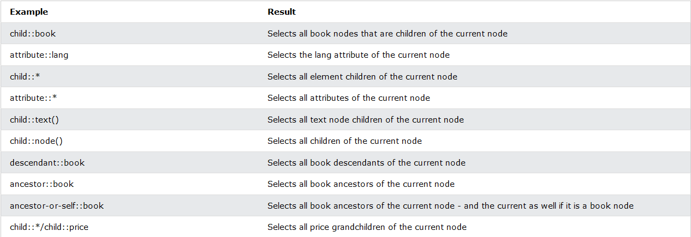
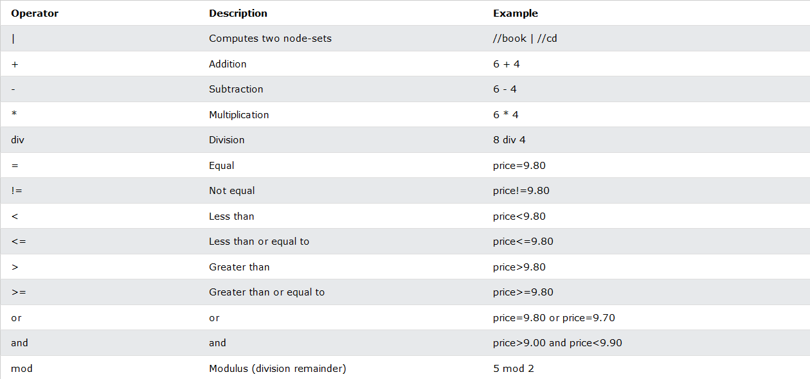
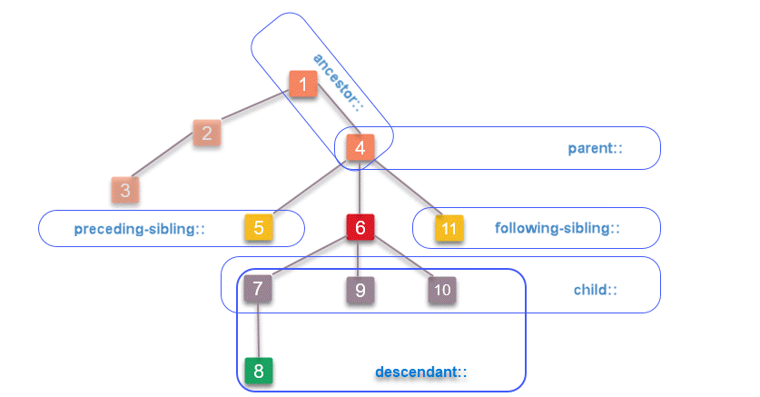

# XPATH

* XML Path Language
* Uses path-like syntax to navigate nodes
* 200+ built in functions
* element in XSLT standard
* W3C recommendation
* Supported in many languages

## What to consider when choosing an XPath

* A good locator is
  * unique
  * descriptive
  * resilient
  * short

## Terminology

* **Nodes** 
  * 7 kinds of .nodes
    * element
    * attribute
    * text
    * namespace
    * processing-instruction
    * comment
    * document node
  * XML documents - trees of nodes
  * Topmost element of the tree - **root**
* **Atomic values** - nodes with no children or parent
* **Items** - atomic values or nodes

## Relationship of nodes

* **Parent** - each element and attribute has one parent.
* **Children** - element nodes may have 0, one or more children
* **Siblings** - nodes that have same parent
* **Ancestors** - a node's parent, parent's parent...
* **Descendants** - a node's children, children's children...

## XPath Syntax

```xml
<bookstore>
    <book>
        <title lang="en">Harry Potter</title>
        <price>29.99</price>
    </book>

    <book>
        <title lang="en">Learning XML</title>
        <price>39.95</price>
    </book>
    
</bookstore>
```

### Selecting nodes

* XPath uses path expressions to select nodes in an XML document
* most used expressions are
  * `nodename`
  * `/` - from the root
  * `//` - selects nodes from the current node
  * `.` - current node
  * `..` - parent of current node
  * `@` - attributes

### Predicates

* Used to find a specific node or a node that contains a specific value
* Always embedded in square brackets `[]`
* Most used predicates
  * `[1]` - first element
  * `[last()]` - last element
  * `[last()-1]` - last but one
  * `[position()<3]` - first two elements
  * `[@lang]` - all elements that have lang attribute
  * `[@lang='en']`
  * `[price>35]`

### Selecting unknown nodes

* XPath wildcards can be used to select unknown XML nodes.
* Most used wildcards
  * `*` - any element node
  * `@*` - any attribute node
  * `node()` - any node of any kind

### Selecting several paths

* Using `|` operator
* Examples
  * `//book/title | //book/price`
  * `//title | //price`
  * `/bookstore/book/title | //price`

## XPath Axes

* An axis represents a relationship to the context (current) node, and is used to locate nodes relative to that node on the tree.
* Most commonly used
  * `ancestor` - Selects all ancestors (parent, grandparent, etc.) of the current node
  * `ancestor-or-self` - Selects all ancestors (parent, grandparent, etc.) of the current node and the current node itself
  * `attribute` - Selects all attributes of the current node
  * `child`Selects all children of the current node
  * `descendant` - Selects all descendants (children, grandchildren, etc.) of the current node
  * `descendanr=t-or-self` -  	Selects all descendants (children, grandchildren, etc.) of the current node and the current node itself
  * `following` - Selects everything in the document after the closing tag of the current node
  * `following-sibling` - Selects all siblings after the current node
  * `namespace` - Selects all namespace nodes of the current node
  * `parent` - Selects the parent of the current node
  * `preceding` - Selects all nodes that appear before the current node in the document, except ancestors, attribute nodes and namespace nodes
  * `preceding-sibling` - Selects all siblings before the current node
  * `self` -  	Selects the current node
* Examples
  * 

## Location Path Expressions

* A location path can be absolute or relative
* An absolute location path starts with a slash ( / ) and a relative location path does not. In both cases the location path consists of one or more steps, each separated by a slash:

## Operators



## Absolute XPath

* Starts with the root of the HTML
* Starts with `/html` and with `/`
* Not advisable
  * lengthier and not readable
  * not resilient - tend to break
* not recommended to use absolute XPath in Selenium
* Example `/html/body/div[1]/div[2]/form/div[2]/input`

## Relative XPath

* Locating element with respect to a element with known Xpath
* Starts with `//`
* Examples
  * `//div[@id="elementId"]/input`
  * `//form/*/input
* Absolute XPaths are faster than the relative XPaths
* When using`relative XPaths we should use the shortest possible XPath

## Exact XPath

* Locating elements using their own tag-name, attributes , values and inner text.
* Exact Xpath is resilient to structural changes of the web page.

## Locating elements with a known attribute / tag-name and attribute

* Syntax
  * `//*[@attributeName='value']`
  * `//tagName[@attributeName='value']` - this is most commonly used XPath

## Locating elements with static visible text

### Exact text

* Locate element containing exact text within tags - innerText - case sensitive
  * `//tagName[text()='exactText']`
  * `*[text()='exactText']`
* It is not recommended
  * if we are testing multilingual application
  * when same text is appearing in more than one location

### Part of visible text (partial match)

* Examples
  * `//tagName[contains(text(), 'substring')]`
  * `//tagName[contains(., 'substring')]`
  * `//*[contains(text(), 'substring')]`

### When prefix of the inner text is static

* Examples
  * `//tagName[starts-with(text(), 'prefix')]`
  * `//*[starts-with(text(), 'prefix')]`

## Locating elements with Visible text in input elements

* When we talk about input elements they don't have innerText, they have attribute **value**
* Example
  * `//input[@value='Test']`

## Locating elements with multiple attributes

* We use two or more attributes together in order to locate elements
* Examples
  * `//*[attribute1='value'][attribute2='value']..[attributeN='valueN']`
  * `//tagName[attribute1='value'][attribute2='value']..[attributeN='valueN']`
  * `//*[attribute1='value' and attribute2='value']`
  * `//tagName[attribute1='value' and attribute2='value']`

## Locating elements with dynamic attribute values

* Examples
  *`//elementName[contains(@attributeName,’substring of the value’)]`
  * `//*[contains(@attributeName,’substring of the value’)]`
  * `//elementName[starts-with(@attributeName,’fixed prefix of the value’)]`

## Locating elements relative to known element

* If our target elements do not have unique attribute(s) or static innerHTML, we need to locate the elements with respective to an element who has an unchanging XPath.
* XPath for these needs has 13 different axes
* Your target element should be closer to the known element (context element) to make XPath shorter, resilient  and readable.
* 

### Locating parent element

* The parent axis contains the parent of the context node
* Every context element has only one parent element, except for root(html)
* Syntax
  * `//<knownXPath>/parent::*`
  * `//<knownXPath>/parent::elementName`
  * `//<knownXPath>/..`
* There can be only one parent to a context (known) element. Hence specifying the element name is optional. But it is good to specify the element name for readability.

### Locating a child element

* The child axis contains the children of the context node
* Examples
  * `//<xpathOfContextElement>/child::<elementName>`
  * `//<xpathOfContextElement>/child::*`
  * `//<xpathOfContextElement>/<elementName>`

### Locating grand-children

* Syntax
  * `//<xpathOfContextElement>/*/<elementName>` 
  * `//<xpathOfContextElement>/child/<elementName> `

### Locating ancestors of a known element

* The ancestor axis contains the ancestors of the known element; ancestor axis consists of the parent of a known element and the parent’s parent so on
* Syntax
  * `//<xpathOfContextElement>/ancestor::<elementName>`
  * `//<xpathOfContextElement>/ancestor::*`
  
### Locating descendants of a known element

* The descendant axis contains the descendants of a known element; descendant axis consists of the children of a context element and their children and so on
* Syntax
  * `//<xpathOfContextElement>/descendant::<elementName>`
  * `//<xpathOfContextElement>/descendant::*`
* In order to locate descendants we can also use `//` instead of `descendant::`

### Locating the following element

* Keyword **following::** can be used for locating  element(s) anywhere below the tree with respect to a known element (context element).
* Syntax
  * `//<xpathOfContextElement>/following::<elementName>`
  * `//<xpathOfConextElement>/following::*`

### Locating preceding element

* Keyword **preceding::** is used for locating an element before a known (XPath) element.
* The preceding axis contains all nodes that are descendants of the root of the tree in which the context node is found, are not ancestors of the context node, and occur before the context node in document order
* Syntax
  * `//<xpathOfContextElement>/preceding::<elementName>`
  * `//<xpathOfContextElement>/preceding::*`

### Locating following sibling

* Keyword **following-sibling::** is used to locate the element(s) comes after a context element within same HTML hierarchy. 
* Following siblings are the elements (children) of the context node’s parent that occur after the context element in document order
* Syntax
  * `//<xpathOfContextElement>/following-sibling::<elementName>`
  * `//<xpathOfContextElement>/following-sibling::*`

### Locating preceding sibling

* Keyword preceding-sibling:: is used to selects the sibling(s) that comes before the context node with a known XPath, those elements (children) of the context node’s parent that occur before the context element in document order.
* Syntax
  * `//<xpathOfKnownElement>/preceding-sibling::<elementName>`
  * `//<xpathOfKnownElement>/preceding-sibling::*`
  
## Notes Selenium XPath

* Selenium will pick first element in the path of there are multiple candidates for a given XPath if we use `findElement`
* If we use `findElements` all the candidate elements can be assigned to a List

## Websites for practice

* [XPath diner](https://topswagcode.com/xpath/)
* [XPath practice page](https://selectorshub.com/xpath-practice-page/)
* [CSSify - XPath to CSS](http://cssify.appspot.com/)