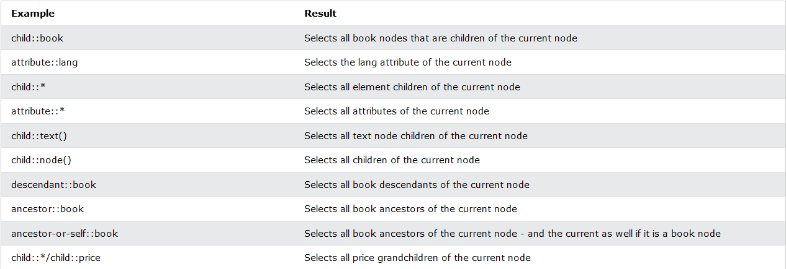

# XPATH

* XML Path Language
* Uses path-like syntax to navigate nodes
* 200+ built in functions
* element in XSLT standard
* W3C recommendation
* Supported in many languages

## Terminology

* **Nodes** 
  * 7 kinds of .nodes
    * element
    * attribute
    * text
    * namespace
    * processing-instruction
    * comment
    * document node
  * XML documents - trees of nodes
  * Topmost element of the tree - **root**
* **Atomic values** - nodes with no children or parent
* **Items** - atomic values or nodes

## Relationship of nodes

* **Parent** - each element and attribute has one parent.
* **Children** - element nodes may have 0, one or more children
* **Siblings** - nodes that have same parent
* **Ancestors** - a node's parent, parent's parent...
* **Descendants** - a node's children, children's children...

## XPath Syntax

```xml
<bookstore>
    <book>
        <title lang="en">Harry Potter</title>
        <price>29.99</price>
    </book>

    <book>
        <title lang="en">Learning XML</title>
        <price>39.95</price>
    </book>
    
</bookstore>
```

### Selecting nodes

* XPath uses path expressions to select nodes in an XML document
* most used expressions are
  * `nodename`
  * `/` - from the root
  * `//` - selects nodes from the current node
  * `.` - current node
  * `..` - parent of current node
  * `@` - attributes

### Predicates

* Used to find a specific node or a node that contains a specific value
* Always embedded in square brackets `[]`
* Most used predicates
  * `[1]` - first element
  * `[last()]` - last element
  * `[last()-1]` - last but one
  * `[position()<3]` - first two elements
  * `[@lang]` - all elements that have lang attribute
  * `[@lang='en']`
  * `[price>35]`

### Selecting unknown nodes

* XPath wildcards can be used to select unknown XML nodes.
* Most used wildcards
  * `*` - any element node
  * `@*` - any attribute node
  * `node()` - any node of any kind

### Selecting several paths

* Using `|` operator
* Examples
  * `//book/title | //book/price`
  * `//title | //price`
  * `/bookstore/book/title | //price`

## XPath Axes

* An axis represents a relationship to the context (current) node, and is used to locate nodes relative to that node on the tree.
* Most commonly used
  * `ancestor` - Selects all ancestors (parent, grandparent, etc.) of the current node
  * `ancestor-or-self` - Selects all ancestors (parent, grandparent, etc.) of the current node and the current node itself
  * `attribute` - Selects all attributes of the current node
  * `child`Selects all children of the current node
  * `descendant` - Selects all descendants (children, grandchildren, etc.) of the current node
  * `descendanr=t-or-self` -  	Selects all descendants (children, grandchildren, etc.) of the current node and the current node itself
  * `following` - Selects everything in the document after the closing tag of the current node
  * `following-sibling` - Selects all siblings after the current node
  * `namespace` - Selects all namespace nodes of the current node
  * `parent` - Selects the parent of the current node
  * `preceding` - Selects all nodes that appear before the current node in the document, except ancestors, attribute nodes and namespace nodes
  * `preceding-sibling` - Selects all siblings before the current node
  * `self` -  	Selects the current node
* Examples
  * 

## Location Path Expressions

* A location path can be absolute or relative
* An absolute location path starts with a slash ( / ) and a relative location path does not. In both cases the location path consists of one or more steps, each separated by a slash:

## Operators


<https://selectorshub.com/xpath-practice-page/>